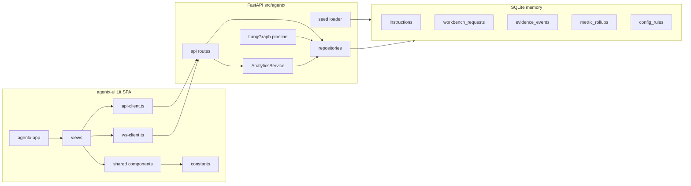
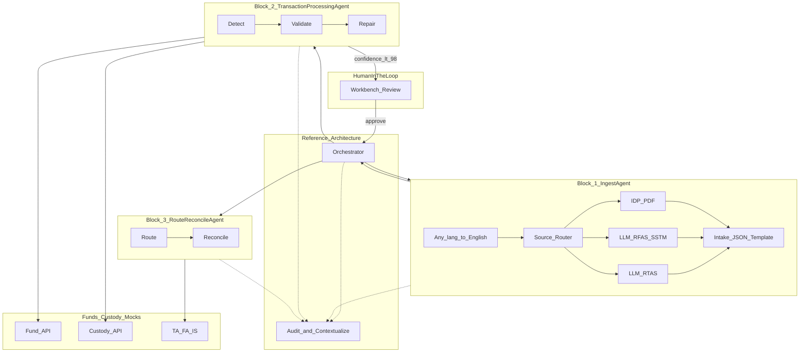
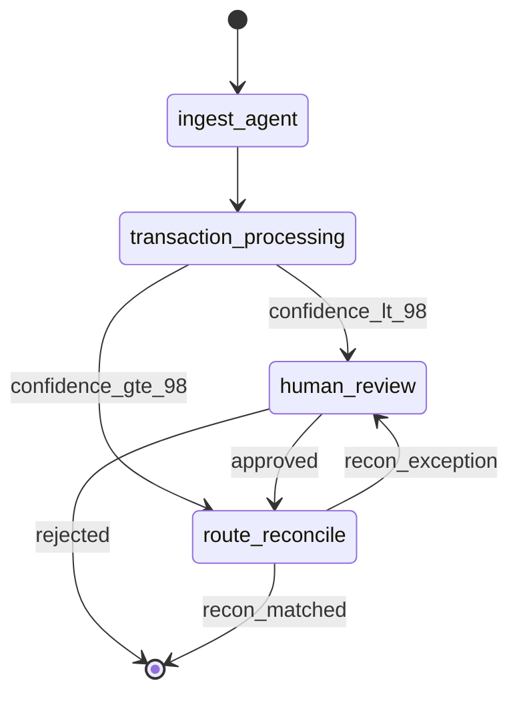

# AgentX — Full Implementation Plan

> **Exported:** 2026-07-18  
> **Reference wireframe:** `agentx-wireframes-v7.html` (visual/UX reference only — not shipped)  
> **Scope:** End-to-end AgentX — LangGraph 3-block agent pipeline + Lit 3 enterprise UI + SQLite in-memory demo data

---

## Overview

Build a **demo-ready end-to-end application**:

| Layer | Technology | Location |
|-------|------------|----------|
| Backend API + agents | Python 3.12, FastAPI, LangGraph, SQLAlchemy | `src/agentx/` |
| Frontend UI | Lit 3, TypeScript, Vite, Vaadin Router | `agentx-ui/` |
| Demo data | JSON seed → SQLite `:memory:` on startup | `seed/demo_data.json` |
| Wireframe reference | Static HTML prototype | `agentx-wireframes-v7.html` |

**Core rule:** Operational/demo data lives in the backend DB (seeded + live pipeline). Product copy, enums, and presentation rules stay in frontend constants. **No hardcoded metrics or transaction rows in UI source.**

---

## Implementation Checklist

### Phase 1 — Backend foundation + seed
- [ ] `backend-scaffold-seed` — FastAPI + SQLite `:memory:` schema/repos, `seed/demo_data.json`, mock external APIs (Fund/Custody/AML/TA/FA/IS), SqliteSaver stub

### Phase 2 — LangGraph agent pipeline (MVP-required)
- [ ] `ingest-providers` — `shared/providers/` — AuthProvider + ModelInvoker, ProviderFactory (Enterprise IDP / Cloud LLM / Local LLM)
- [ ] `ingest-agent` — `layers/ingest/` — localization, `parser_registry.yaml`, ParserLoader, one `.py` parser per source (`idp`, `rfas`, `sstm`, `rtas`, `json`)
- [ ] `langgraph-pipeline` — `layers/orchestrator/` — LangGraph parent graph, InstructionState, 98% gate, HITL interrupt, SqliteSaver checkpoints
- [ ] `txn-processing-layer` — `layers/transaction_processing/` — Detect+Validate+Repair agent, mock Fund/Custody tools, golden schema mapping
- [ ] `route-reconcile-layer` — `layers/route_reconcile/` — Route+Reconcile agent, TA/FA/IS dispatch, settlement match, recon exception → HITL
- [ ] `audit-contextualize` — `layers/audit_contextualize/` — append-only evidence, journey sub-step updates, audit tab + txn modal timeline
- [ ] `pipeline-runner` — `POST /ingest` triggers orchestrator; resume on workbench approve; pipeline events → `metric_rollups`

### Phase 3 — API + Workbench HITL
- [ ] `api-core` — REST workbench HITL — queue, exceptions, kanban, workspace, approve/reject/escalate, field correction, WebSocket `/ws/ops`

### Phase 4 — Analytics + Ops Assistant (MVP-required)
- [ ] `analytics-service` — `layers/analytics/` — AnalyticsService full metric catalog (all wireframe KPIs + insights drawer)
- [ ] `api-analytics` — `GET /dashboard/*`, `/workbench/insights`, `/audit`, `/config/rules`, `/me`, `/assistant/welcome`
- [ ] `ops-assistant` — `layers/ops_assistant/` — LangGraph ReAct agent, 8 read-only analytics tools, SSE `POST /assistant/chat`

### Phase 5 — Lit UI + E2E demo
- [ ] `lit-scaffold` — `agentx-ui/` Lit 3 + TS + Vite + Vaadin router, `tokens.css`, app shell matching wireframe chrome
- [ ] `lit-shared-components` — Reusable Lit components — wireframe-card, kpi-tile, step-tracker, status-pill, conf-bar, data-table, toast
- [ ] `lit-views` — All 6 tab views + txn-modal + review-workspace + assistant panel wired to APIs (zero hardcoded metrics)
- [ ] `lit-interactive` — Kanban PATCH, approve/reject/comment, WebSocket refresh, SLA ticker, ingest → live queue updates

### Optional (post-MVP)
- [ ] `vector-store` — ChromaDB embedded — Ops Assistant RAG + semantic duplicate hints
- [ ] `refer-graph` — NetworkX in-memory refer graph in `audit_contextualize`

---

## MVP Agent Scope

MVP delivers a **3-block transaction pipeline** plus cross-cutting services:

| Component | Type | Wireframe stages | Deliverable |
|-----------|------|------------------|-------------|
| **Orchestrator** | LangGraph parent graph | All | Routes between blocks, HITL interrupts, checkpoint resume |
| **IngestAgent** | Hybrid (IDP + LLM parsers) | Stage 1 — Ingestion | Multi-source → English → **Intake JSON** |
| **TransactionProcessingAgent** | LLM agent | Stages 2–4 — Detect, Validate, Repair | Golden schema, 98% confidence gate |
| **RouteReconcileAgent** | LLM agent | Stages 5–6 — Route, Reconcile | TA/FA/IS dispatch, settlement match |
| **Audit & Contextualize** | Cross-cutting service | All | Append-only evidence, journey updates |
| **AnalyticsService** | Deterministic service | N/A | Dashboard KPIs, insights drawer |
| **OpsAssistantAgent** | LLM conversational agent | N/A | Chat with wireframe suggested queries |

**UI still shows 6 journey stages** — each block updates `journey.active_step` / `completed_through` internally.

**Explicitly out of MVP:** External PostgreSQL, Redis, docker-compose. SQLite `:memory:` library only.

### Two orthogonal state machines (from wireframe)

| Dimension | States | Purpose |
|-----------|--------|---------|
| **STP Journey** (6 stages) | Ingest → Detect → Validate → Repair → Route → Reconcile | Automated processing pipeline |
| **Workbench Queue** (6 columns) | Submitted → AI Validation → Human Review → Approved / Rejected / Escalated | Where ops acts |

### Critical business rules
- **98% confidence gate** — below threshold holds at Repair (stage 4) for human review
- **Golden Transaction Schema** — normalized output all agents converge on
- **Field-level confidence heatmap** — per-field scores (ISIN, Amount, Quantity, etc.)
- **Evidence timeline** — immutable audit of every agent decision and human correction
- **Intents:** Subscription, Redemption, Switch, Transfer
- **Channels:** SWIFT, Email+PDF, API, Portals & Files, Client Templates
- **Destinations:** TA, FA, IS

---

## Target Repository Layout

```
agent-ingestion/
├── requirements.txt
├── pyproject.toml
├── AGENTX_IMPLEMENTATION_PLAN.md    # this file
├── agentx-wireframes-v7.html        # reference only — not shipped
├── seed/
│   └── demo_data.json               # wireframe mock → DB initial load
├── schemas/
│   └── intake_json_template.json
├── src/agentx/
│   ├── main.py
│   ├── config.py
│   ├── domain/
│   ├── db/
│   │   ├── engine.py                # SQLite :memory: (sqlalchemy + aiosqlite)
│   │   ├── schema.py
│   │   ├── seed.py
│   │   └── repositories/
│   ├── api/
│   ├── workers/                     # Pipeline runner
│   ├── layers/                      # ★ One folder per layer/agent
│   │   ├── orchestrator/            # LangGraph parent graph + HITL
│   │   ├── ingest/                  # IngestAgent + parsers/
│   │   ├── transaction_processing/  # Detect + Validate + Repair
│   │   ├── route_reconcile/         # Route + Reconcile
│   │   ├── audit_contextualize/     # Evidence + contextualize
│   │   ├── analytics/               # AnalyticsService (deterministic)
│   │   └── ops_assistant/           # OpsAssistantAgent (chat)
│   └── shared/
│       ├── providers/               # AuthProvider + ModelInvoker + ProviderFactory
│       └── mocks/                   # Fund, Custody, AML, TA/FA/IS, Settlement
├── agentx-ui/                       # Lit 3 + TypeScript + Vite
│   ├── package.json
│   ├── vite.config.ts               # proxy /api → :8000
│   └── src/
│       ├── app/agentx-app.ts
│       ├── styles/tokens.css
│       ├── constants/               # frontend-static only
│       ├── models/                  # TS interfaces = API DTOs
│       ├── services/api-client.ts
│       └── components/              # layout, shared, dashboard, queue, workbench, ...
└── tests/
    └── layers/
```

---

## Architecture

### End-to-end system



### 3-block agent pipeline



### LangGraph state machine



---

## Backend Agent Details

### Block 1 — IngestAgent

Multi-source → English → **Intake JSON** (canonical contract for downstream agents).

| Source | Parser (MVP) | Provider | Module |
|--------|--------------|----------|--------|
| PDF / unstructured | `idp` | `enterprise_idp` | `parsers/pdf/idp.py` |
| SWIFT | `rfas` | `cloud_llm` | `parsers/swift/rfas.py` |
| SWIFT (alt) | `sstm` | `cloud_llm` | `parsers/swift/sstm.py` |
| Excel | `rtas` | `cloud_llm` | `parsers/excel/rtas.py` |
| API | `json` | `none` | `parsers/api/json.py` |

**Parser plugin pattern:** `parser_registry.yaml` → `ParserLoader` (importlib) → `parse()`. One file per source in MVP; versioned swap post-MVP.

**ProviderFactory:** Parsers receive injected `ModelInvoker` + `AuthProvider` — never import OpenAI/Azure SDK directly.

### Block 2 — TransactionProcessingAgent

| Sub-step | Journey stage | Key tools |
|----------|---------------|-----------|
| Detect | 2 | `classify_intent`, `extract_entities` |
| Validate | 3 | `fund_api_lookup`, `custody_verify`, `aml_screen`, `duplicate_check`, `rules_engine` |
| Repair | 4 | `infer_settlement_date`, `normalize_isin`, `nav_quantity_calc`, `golden_schema_mapper` |

**98% gate:** `overall_confidence < 0.98` → `orchestrator.interrupt("human_review")`.

### Block 3 — RouteReconcileAgent

| Sub-step | Journey stage | Key tools |
|----------|---------------|-----------|
| Route | 5 | `routing_rules`, `dispatch_to_ta`, `dispatch_to_fa`, `dispatch_to_is` |
| Reconcile | 6 | `fetch_settlement`, `compare_amounts` |

Recon exception → HITL with `journey.failed_step = 6`.

### Audit & Contextualize

- Append `EvidenceEvent` on every sub-step completion
- Update `journey` tracker fields for UI step bars
- Powers Audit tab and evidence timeline in transaction detail modal
- Human approve → merge corrections → log evidence → resume Orchestrator

### AnalyticsService (NOT an LLM agent)

Deterministic SQL aggregations for all wireframe KPIs. Same data whether shown on dashboard or cited in chat.

### OpsAssistantAgent (separate LLM agent)

LangGraph ReAct agent with 8 read-only tools over AnalyticsService:

| Tool | Wireframe chat pattern |
|------|------------------------|
| `get_sla_summary` | SLA compliance today |
| `get_recon_exceptions` | Reconciliation exceptions |
| `get_exception_summary` | High priority exceptions |
| `get_bottleneck_stage` | Journey bottleneck |
| `get_channel_validation_failures` | SWIFT validation failures |
| `get_dashboard_snapshot` | Welcome stat chips |
| `search_instructions` | List instruction IDs |
| `get_instruction_detail` | Deep-dive on INS-* ref |

---

## Persistence — SQLite in-memory

```python
# db/engine.py (MVP)
DATABASE_URL = "sqlite+aiosqlite:///:memory:"
# Shared cache: "sqlite+aiosqlite:///file:agentx?mode=memory&cache=shared"
```

| Table | Contents |
|-------|----------|
| `instructions` | intake_json, golden_schema, journey, status |
| `evidence_events` | Append-only audit trail |
| `workbench_requests` | Kanban cards, SLA, assignee, comments (JSON column) |
| `metric_rollups` | Dashboard / analytics counters |
| `assistant_query_log` | Chat tool-call audit |
| `config_rules` | Validation + repair rule names |
| LangGraph checkpoint tables | Via `SqliteSaver` on same `:memory:` connection |

Data is lost on process restart — seed script repopulates demo data. Post-MVP: PostgreSQL via `DATABASE_URL` change.

---

## Data Classification — Backend vs Frontend

**Rule:** If it changes when a new instruction is ingested or ops acts → **backend + seed**. If it only changes on a product release → **frontend static**.

### Backend (seed DB + API)

| Wireframe source | Target table | API endpoint | Lit consumer |
|------------------|--------------|--------------|--------------|
| Dashboard KPIs (96.8%, 99.4%, 4.1s, 2,443, secondary tiles) | `metric_rollups` | `GET /dashboard/kpis` | `dashboard-view` |
| Journey stage bars | `metric_rollups` | `GET /dashboard/journey-health` | `journey-health-chart` |
| Attention panel (12 / 3 / 8 / 5) | `metric_rollups` | `GET /dashboard/attention` | `attention-panel` |
| Channel / routing / intent breakdowns | `metric_rollups` | `GET /dashboard/channels`, `/routing`, `/intents` | dashboard charts |
| `loadQueueTable()` rows (5) | `instructions` | `GET /instructions` | `queue-table` |
| `loadExceptionsTable()` rows (5) | `instructions` | `GET /exceptions` | `exceptions-table` |
| `requests[]` kanban cards (8) | `workbench_requests` | `GET /workbench/requests` | `kanban-board` |
| `txnDetails{}` (5 refs) | `instructions`, `field_confidences`, `evidence_events` | `GET /instructions/{id}` | `txn-modal` |
| Workspace (findings, heatmap, timeline, comments) | same | `GET /workbench/requests/{id}` | `review-workspace` |
| Workbench insights strip + drawer | derived | `GET /workbench/insights` | `insights-drawer` |
| Audit trail | `evidence_events` | `GET /audit` | `audit-view` |
| Configuration rules | `config_rules` | `GET /config/rules` | `configuration-view` |
| Assistant welcome chips | `metric_rollups` | `GET /assistant/welcome` | `assistant-panel` |
| Chat replies | OpsAssistantAgent | `POST /assistant/chat` (SSE) | `assistant-panel` |
| User greeting ("SCB User") | stub | `GET /me` | `app-header` |
| Writes (approve, drag, comment) | live | `PATCH`, `POST` | workbench, modal |

**Seed normalization:** Dashboard **47** as authoritative exception count; seed 8 workbench cards + 5 queue rows + 5 exception rows as linked instruction graph.

### Frontend static (`agentx-ui/src/constants/`)

| Item | Why frontend |
|------|--------------|
| `JOURNEY_STEPS`, `WORKBENCH_STAGES` | Domain labels + icons |
| Filter enums (status, channel, intent, destination) | UX labels; API uses same values |
| Pipeline reference help text | Product copy |
| Nav routes, branding, section titles | App chrome |
| Design tokens (`--corp-navy`, etc.) | CSS variables |
| Assistant suggested query button labels | UX templates; queries go to API |
| Confidence / SLA / risk color thresholds | Presentation rules from API numbers |
| `step-tracker` render logic | Pure UI from `journey` object from API |
| Empty/loading/error copy | UX strings |

---

## API Contract

| Endpoint | Response shape (key fields) |
|----------|----------------------------|
| `GET /dashboard/kpis` | `{ primary: KpiTile[], secondary: KpiTile[] }` |
| `GET /dashboard/journey-health` | `{ stages: StageHealth[], overall_stp: number }` |
| `GET /dashboard/attention` | `{ total, high_priority, sla_at_risk, recon_mismatches, aml_holds }` |
| `GET /dashboard/channels` | `ChannelStat[]` |
| `GET /dashboard/routing` | `{ ta, fa, is }` (percentages) |
| `GET /dashboard/intents` | `IntentStat[]` |
| `GET /instructions` | `InstructionSummary[]` |
| `GET /exceptions` | `ExceptionSummary[]` |
| `GET /instructions/{id}` | `InstructionDetail` |
| `GET /workbench/requests` | `WorkbenchCard[]` |
| `GET /workbench/requests/{id}` | `WorkbenchDetail` |
| `GET /workbench/insights` | strip stats + distribution + SLA bands |
| `PATCH /workbench/requests/{id}/stage` | kanban drag-drop |
| `POST /instructions/{id}/approve` | modal approve + evidence log |
| `GET /audit` | `EvidenceEvent[]` (paginated) |
| `GET /config/rules` | `{ validation: string[], repair: string[] }` |
| `GET /assistant/welcome` | `{ stats: StatChip[], greeting }` |
| `POST /assistant/chat` | SSE stream `{ content, meta?: { stats } }` |
| `POST /ingest` | multipart file + `source_type` → triggers pipeline |
| `GET /me` | `{ display_name }` |
| `WS /ws/ops` | `{ type: "instruction_updated" \| "workbench_updated", id }` |

---

## Lit UI Structure

### Component map (wireframe → Lit)

| Wireframe pattern | Lit component | Notes |
|-------------------|---------------|-------|
| `.wireframe-card` | `ax-wireframe-card` | slot-based wrapper |
| `.kpi-value` tiles | `ax-kpi-tile` | props: `value`, `label`, `delta`, `variant` |
| `.step-tracker` | `ax-step-tracker` | props: `journey`, `context`, `variant` |
| `.status-pill` | `ax-status-pill` | props: `status`, `tone` |
| `.conf-bar` | `ax-conf-bar` | props: `value` (0–100) |
| `.heatmap-grid` | `ax-heatmap-grid` | props: `fields: Record<string, number>` |
| `.kanban-board` | `ax-kanban-board` | drag-drop → API PATCH |
| `#txn-modal` | `ax-txn-modal` | loads `GET /instructions/{id}` |
| `#review-workspace` | `ax-review-workspace` | full-screen overlay |
| `#chat-window` | `ax-assistant-panel` | SSE streaming |

**Styling:** Port wireframe CSS tokens into `tokens.css` + Lit `static styles`. No Tailwind CDN.

**Routing:** `@vaadin/router` — `/dashboard`, `/queue`, `/exceptions`, `/workbench`, `/audit`, `/configuration`.

---

## Implementation Phases (delivery order)

### Phase 1 — Backend foundation + seed
- FastAPI, `requirements.txt`, SQLAlchemy `:memory:`, schema, repositories
- Extract `seed/demo_data.json` from wireframe JS
- Mock external APIs in `shared/mocks/`
- `SqliteSaver` connection for LangGraph checkpoints

### Phase 2 — LangGraph agent pipeline (7 layer folders)
- `shared/providers/` — ProviderFactory
- `layers/ingest/` — parsers + localization
- `layers/orchestrator/` — parent graph + HITL
- `layers/transaction_processing/` — detect → validate → repair
- `layers/route_reconcile/` — route → reconcile
- `layers/audit_contextualize/` — evidence + journey updates
- `POST /ingest` + pipeline events → `metric_rollups`
- Unit tests per layer folder

### Phase 3 — API + Workbench HITL
- REST read/write endpoints for queue, exceptions, workbench, instruction detail
- Approve/reject/escalate → resume Orchestrator
- WebSocket `/ws/ops`

### Phase 4 — Analytics + Ops Assistant
- `AnalyticsService` — full metric catalog
- Dashboard + insights REST endpoints
- `OpsAssistantAgent` — SSE chat
- `GET /assistant/welcome`

### Phase 5 — Lit UI + E2E demo
- **5a:** Scaffold + shared components
- **5b:** All 6 views wired to read APIs
- **5c:** Interactive writes + WebSocket + SLA ticker
- **5d:** Live ingest demo (`POST /ingest` → new queue rows)

---

## Acceptance Criteria

1. **Visual parity** — side-by-side with wireframe: layout, colors, 6-tab nav, overlays
2. **No hardcoded metrics** — grep `agentx-ui/src` finds no `96.8`, `2,443`, `INS-7843921`, or kanban card data
3. **Seed round-trip** — fresh server start populates all dashboard tiles, 5 queue rows, 5 exceptions, 8 kanban cards
4. **Interactive demo** — drag kanban card, approve in modal, toast + evidence update
5. **Full agent pipeline** — all 7 backend layers MVP-required (Phases 2–4), not stubs
6. **Assistant** — welcome chips from API; suggested queries via OpsAssistantAgent SSE

---

## Key Files to Create

| Path | Purpose |
|------|---------|
| `seed/demo_data.json` | Wireframe mock → DB initial load |
| `src/agentx/main.py` | FastAPI app + seed on startup |
| `src/agentx/db/schema.py` | All tables |
| `src/agentx/layers/orchestrator/graph.py` | LangGraph parent graph + HITL |
| `src/agentx/layers/ingest/agent.py` | IngestAgent + parser routing |
| `src/agentx/layers/transaction_processing/agent.py` | Detect + Validate + Repair |
| `src/agentx/layers/route_reconcile/agent.py` | Route + Reconcile |
| `src/agentx/layers/audit_contextualize/service.py` | Evidence service |
| `src/agentx/layers/analytics/service.py` | Dashboard + insights queries |
| `src/agentx/layers/ops_assistant/agent.py` | OpsAssistantAgent chat |
| `agentx-ui/src/app/agentx-app.ts` | Root Lit app |
| `agentx-ui/src/components/shared/step-tracker.ts` | Port `renderStepTracker` logic |

---

## Tech Stack & Dependencies

| Layer | MVP |
|-------|-----|
| Runtime | Python 3.12 |
| API | FastAPI + Uvicorn |
| Agents | LangGraph + LangChain |
| LLM | OpenAI / Azure OpenAI / Ollama (configurable) |
| IDP | Mock invoker + pluggable enterprise client |
| Persistence | SQLite `:memory:` (sqlalchemy + aiosqlite) + SqliteSaver |
| Frontend | Lit 3 + TypeScript + Vite |
| Realtime | In-process WebSocket broadcaster |

### requirements.txt (MVP core)

```text
fastapi>=0.115.0
uvicorn[standard]>=0.32.0
python-multipart>=0.0.9
pydantic>=2.0
pydantic-settings>=2.0
sqlalchemy>=2.0
aiosqlite>=0.20.0
langgraph>=0.2.0
langgraph-checkpoint>=2.0.0
langchain-core>=0.3.0
langchain-openai>=0.2.0
pyyaml>=6.0
httpx>=0.27.0
openpyxl>=3.1.0
langdetect>=1.0.9
sse-starlette>=2.0
pytest>=8.0
pytest-asyncio>=0.24.0
```

---

## Key Design Decisions

1. **One folder per layer** — each self-contained with `agent.py`, `prompts/`, `tools/`, `schemas/`, `tests/`
2. **3-block pipeline, 6-stage UI** — execution vs observability separation
3. **Ingest outputs Intake JSON** — downstream agents never re-parse raw files
4. **Agents where reasoning matters** — deterministic rules + LLM for ambiguous cases
5. **Event-sourced evidence** — never mutate audit rows; append deltas
6. **Journey vs Workbench decoupling** — independent fields (e.g. stage 6 journey + "AI Validation" workbench)
7. **Analytics vs chat separation** — KPIs in AnalyticsService; Ops Assistant for NL only
8. **Parser plugins** — `.py` code + YAML registry; data in SQLite, not files
9. **Provider abstraction** — injected `ModelInvoker`; parsers never import SDKs directly
10. **SQLite in-memory for MVP** — no external DB servers; Postgres post-MVP

---

## Risks and Mitigations

| Risk | Mitigation |
|------|------------|
| LLM non-determinism breaks STP | Temperature 0, structured outputs, rule tools enforce hard constraints |
| Latency vs wireframe "4.1s" KPI | Cache mock API calls; parallel tool invocation |
| Cost at scale | Rule engine for deterministic checks; LLM only for ambiguous fields |
| IDP latency on large PDFs | Async ingest with status polling; MVP mock IDP for demos |
| MVP data lost on restart | Expected — seed script repopulates; document in README |
| HITL resume after restart | SQLite `:memory:` is process-local; Postgres post-MVP |

---

## Seed Data Structure (`seed/demo_data.json`)

```json
{
  "metric_rollups": { "stp_rate": 96.8, "sla_compliance": 99.4 },
  "journey_health": [{ "stage": 1, "label": "Ingestion", "pass_rate": 100 }],
  "channels": [{ "name": "SWIFT", "volume": 1284, "stp_rate": 98.2 }],
  "instructions": [],
  "workbench_requests": [],
  "evidence_events": [],
  "config_rules": { "validation": [], "repair": [] },
  "user": { "display_name": "SCB User" }
}
```

Extracted from wireframe JS: `rows`, `requests`, `txnDetails`, dashboard HTML numbers.
